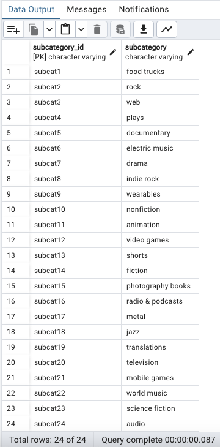

# Crowdfunding_ETL

## Project Overview
For the ETL mini project, we practiced building an ETL pipeline using Python, Pandas, and either Python dictionary methods or regular expressions to extract and transform the data. After we transformed the data, we created four CSV files and used the CSV file data to create an ERD and a table schema. Finally, we uploaded the CSV file data into a Postgres database.
**We developed the code and the different outputs as a team without splitting the work.**

### Steps Performed
- The project is divided in 4 subsections:
    - Create the Category and Subcategory DataFrames
    - Create the Campaign DataFrame
    - Create the Contacts DataFrame
    - Create the Crowdfunding Database

### Create the Category and Subcategory DataFrames
- Imported 'crowdfunding.xlsx' into the project from the resources folder.
- Created a list with the category and subcategory names.
- Used list comprehension to concatenate the number with "cat" and "subcat" in order to create each category_id and subcategory_id respectively.
- Created a DataFrame with category_id and subcategory_id columns.
- Exported Category and Subcategory DataFrames as csv files to the Output folder.

### Create the Campaign DataFrame
- Created a copy of the crowdfunding DataFrame and renamed as campaign_df.
- Changed some columns names for clarity.
- Changes some data types.
- Merged the campaign_df with category_df and subcategory_df, to include the categoriy_id and subcategory_id.
- Eliminated some unnecessary columns to clean the DataFrame.
- Exported DataFrame as 'campaign.csv' to the Output folder.

### Create the Contacts DataFrame
- Imported 'contacts.xlsx' into the project from the resources folder.
- Decided to try both option: Pandas and Regular Expressions.
- Converted each row to a dictionary and extracted the values.
- Split the name column.
- Created a DataFrame with contact_id, first_name, last_name and email.
- Exported DataFrame as 'contact.csv' to the Output folder.

### Create Table Schema
- Created ERD using quickDBD.
- Created 4 tables.
- Define tables and their columns, specifying data types, primary keys, foreign keys, and other constraints.
- Save the schema as 'crowdfunding_db_schema.sql'.

### Create the Crowdfunding Database
- Created a new database crowdfunding_db on PostgreSQL.
- Created the tables using the schema file.
- Imported the csv files in the proper order.
- Verified the tables and content performing the queries on our 'queries_db.sql' file.

## Pre-requisites:
- Libraries: Pandas, Numpy, datetime, json, re
- pgAdmin4 Version 8.2
- PostgreSQL 16

## Instructions to run the project
- Clone the repository to your local.
- Activate your Conda environment.
- Run ETL_Mini_Project_AWu_HSaleh_DMolina.ipynb file.
- When loading the data to the DataBase follow this order: 'category.csv', 'subcatgory.csv', 'contacts.cvs', 'campaing.csv'.

## Project Pipeline
- EXTRACT the excel files which are: 'crowfunding.xlsx' and 'contacts.xlsx.
- TRANFORM data using python code.
- LOAD to a PostgreSQL data base.

## Contributors
- Andrea Wu
- Halima Saleh
- Daniel Molina Valencia